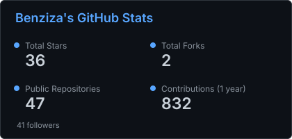
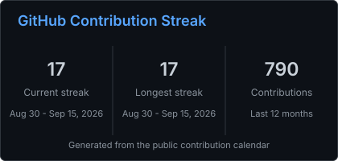
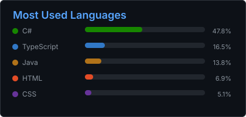

<h1 align="center">Hi , I'm Benziza Mohamed</h1>
<h3 align="center">Software Engineer | Crafting logic, design, and a bit of magic ✨</h3>

---

## 🧭 About Me  

- 🔭 Currently building scalable apps at **Talentplug**  
- 👯 Open to collaborate on **Open Source Projects**  
- 📫 Reach me at **benizizamohamed@gmail.com**

---

## 🧩 What I Bring to the Code  

### 💻 Languages  

   
   
   
  

### ⚙️ Back-End  

   
   

### 🎨 Front-End  

   
   
  

### ☁️ DevOps / Cloud  

   
   
   
   
   
   

### 🗃️ Databases  

   
   

## 🧰 Tools I Use  

   
   
   
   
   
   
  

---

## 📊 GitHub Stats  

  
  
  

---

## 🌐 Connect With Me  

  
  

---

  
  

